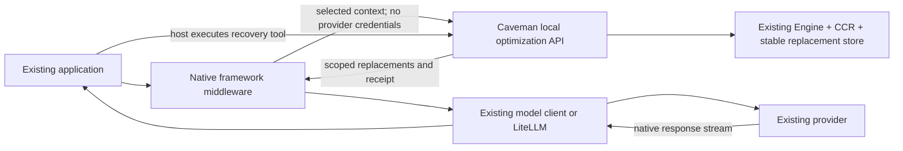

# Framework middleware implementation plan

Status: proposed design derived from [the specification](spec-overview.md).
All package names, exports, and new HTTP paths below are targets, not shipped
interfaces. This plan does not authorize implementation or publication by itself.

## Architecture decision

Keep the Engine as the compression authority. Add a compression-only service
surface to the existing local runtime. Framework adapters select eligible native
text leaves, ask for validated replacements, and apply them to a model-facing
copy. The host still makes every model call and runs every tool.



The network diagram shows one optimizer round-trip, not another inference hop.
Applications can reuse an already-running local proxy process for optimization;
their provider base URL need not change. Remote optimization is explicitly
configured and opt-in. In-process Go embedding can implement the same contract
later; a Python extension, duplicated compressor, or automatic model download is
not required for the first release.

## Ownership and package layout

| Proposed owned area | Responsibility |
|---|---|
| `proxy/internal/middleware/` | Compression-only HTTP handlers, authenticated scope, request validation, replacement planning, runtime receipts |
| `engine/`, `engine/ccr/`, `proxy/internal/store/` | Existing compression, exact originals, and persistent replacements; minimal additive support for scoped grants and retention |
| `packages/shared/contracts/schemas/middleware-*.schema.json` | Optimization envelope, response, receipt, and adapter support schemas; reuse existing Context IR and transform vocabularies |
| `packages/sdk/typescript/src/middleware/` | Dependency-free runtime connection, session scope, result validation, lifecycle; exported from `@caveman-ai/sdk/middleware` |
| `packages/sdk/python/caveman_cloud/middleware/` | Matching stdlib-only synchronous/async runtime client and scope API |
| `packages/sdk/parity/middleware.fixtures.json` | Shared protocol, counter, digest, status, and error fixtures |
| `packages/middleware/typescript/` | Proposed `@caveman-ai/middleware`, explicit subpath exports per framework, optional peer dependencies |
| `packages/middleware/python/` | Proposed `caveman-middleware`, import `caveman_middleware`, optional framework extras |
| `packages/middleware/conformance/` | Neutral fixtures, required support matrix, evidence manifest, task comparisons |
| `examples/middleware/<family>/` | Real, separately locked installed-framework consumers and tested docs examples |

Keep SDK root imports free of optional-framework imports. The existing Python
SDK retains `dependencies = []`; framework or HTTPX dependencies belong in the
optional adapter distribution. Match current SDK runtime floors initially:
Node >=22.13 and Python >=3.13. Support for older Python requires a separately
tested compatibility decision, not silently weakening the SDK's manifest.

Add the new nested workspaces to the workspace/release tooling explicitly.
Check registry name availability before selecting final distribution names.
No private Agent SDK package becomes a dependency. Native framework middleware
is distinct from the Agent SDK's adapters that execute a Caveman-defined agent.

The implementation may extract shared replacement/persistence helpers from the
current proxy path, but must retain its regression behavior. Do not rewrite
provider forwarding or create a parallel compression algorithm to expose an API.

## Proposed runtime protocol

Use the existing listener, transport limits, and authentication seam. Reserve an
explicit route namespace before the provider catch-all. Middleware endpoints
perform no provider credential resolution, upstream forwarding, or signing.

| Method/path | Contract |
|---|---|
| `GET /caveman/v1/middleware/capabilities` | Versioned runtime/build, transform capabilities, limits, persistence and recovery features; no payload/state enumeration |
| `POST /caveman/v1/middleware/optimize` | Batch candidate leaves and return one atomic replacement plan; does not make an inference request |
| `POST /caveman/v1/middleware/retrieve` | Scope-authorized original/excerpt/page retrieval through existing CCR |
| `POST /caveman/v1/middleware/receipts` | Bounded, idempotent client lifecycle/usage observations; metadata only, never implicit verified accounting |

Authentication is inherited from a trusted server-side resolver. Standalone
single-operator mode has one trust principal. Namespace/session strings only
partition that principal's state. Multi-tenant callers use an existing trusted
principal resolver or separate runtime instances. This work does not build a
new account/tenant control plane.

### Optimize input

| Field group | Required semantics |
|---|---|
| `schema_version` | Exact supported revision; initial value 1 |
| `request_id`, `logical_call_id`, `attempt_id`, `idempotency_key` | Distinguish logical model calls, host retries, and replays of one optimizer request |
| `scope` | Namespace, session ID, branch ID, cache epoch, monotonically tracked turn/sequence; no client-selected authorization principal |
| `adapter` | Integration ID, adapter version, framework version, serialization revision |
| `model` | Actual model/provider/protocol when known; null when unknown; credential-free endpoint identity only when proven |
| `mode` | `record` or `compress`; `off` short-circuits in the client without a request |
| `policy` | Versioned set of explicitly enabled transform capabilities; no arbitrary executable options |
| `segments` | Stable segment ID, existing Context IR kind/cache-region vocabulary, original UTF-8 content/hash, source identity, protection constraints |
| `context_manifest` | Ordered digests of native context components, known frozen IDs, parent replacement-set identity; protected component content is not uploaded |
| `recovery_binding` | Current trusted host binding or `none`; a model-visible schema/name is insufficient |

Adapters keep native path/object mappings locally. The service returns
segment-ID replacements, not arbitrary JSON patches against the application.
It constructs complete internal Context IR after counting candidate bytes;
unknown token counts must not be stuffed into the current schema as fake zeroes.
This envelope transports content to the existing IR rather than defining a
second context ontology.

Scope IDs and adapter metadata have documented size/character limits in the
schema. Total optimize JSON is bounded by runtime R10. A single call batches
all eligible leaves under one deadline; it does not perform serial HTTP calls
per tool block.

### Optimize result

| Field group | Required semantics |
|---|---|
| `schema_version`, `request_id`, `input_digest` | Bind the response to exactly one validated request |
| `runtime_build`, `policy_revision`, `replacement_set_id` | Bind the chosen content and durable replay lineage |
| `status`, `reason` | Aggregate outcome plus bounded machine code; per-segment outcomes expose partial eligibility |
| `replacements[]` | Segment ID, original digest, replacement UTF-8/digest, exact transform ID/version, scoped recovery handle if needed |
| `measurement` | Tokenizer, estimate scope, original/final counters where available, marker/tool overhead coverage, and inferred basis |
| `stability` | Native-input stability separately from captured provider-byte stability; unknown is explicit |
| `recovery` | Binding identity, persistence/retention facts, and availability; not the user's credentials |

Unknown required fields or invalid digest/operation/counter relationships reject
the plan. SDKs preserve original input on ordinary errors. The adapter applies
no replacements until the complete response and native mapping are valid.

Initial reason codes include `no_candidate`, `not_smaller`, `protected`,
`unsupported_version`, `unsupported_shape`, `unknown_capability`,
`recovery_unavailable`, `recovery_collision`, `cache_state_unavailable`,
`epoch_changed`, `already_owned`, `deadline`, `capacity`, `payload_limit`,
`invalid_plan`, and `runtime_unavailable`. HTTP 401/403/409/413 distinguish
authorization, identity conflicts, and limits at the service boundary; they
never return a successful-looking plan with another scope's state.

### Recovery and persistence

Reuse exact Engine CCR objects. Add a scoped grant/mapping above their existing
content-addressed handles. Handles exposed to a framework cannot authorize a
global hash lookup. Each replacement stores the original object reference and
the stable marker bytes before returning to the caller.

The native adapter establishes executable recovery through the actual public
host tool registry/dispatcher. Its complete call-options bundle supplies both
the model middleware and recovery tool; the adapter checks the invocation's
registry binding before optimizing. Transport-only wrappers cannot infer this
from serialized tool schemas and default to no recovery. For shared gateways,
the trusted client integration supplies an operator-bound capability; user
headers cannot manufacture one. This is an attestation by the trusted host
integration, not remote proof that arbitrary application code will execute.

Replacement state uses the full identity from runtime R6 and first-writer-wins
persistence. Keep `prepared` decisions distinct from `dispatch_intent`,
`completed`, `failed`, and `cancelled` receipts. Persisting a choice ensures
consistent future choices; it does not prove that choice reached a provider.

Initial middleware session retention is operator-configured, with a documented
24-hour idle default and configurable extension for durable applications.
Active scopes renew their lease. Referenced originals cannot be evicted before
the lease ends. Existing local CCR storage limits still apply: full storage
stops new lossy plans. Expiry can retire a grant/replacement; it does not imply
the global content-addressed Engine store deleted a payload shared elsewhere.
Deletion/privacy documentation must state that distinction and expose the
existing operator-owned store lifecycle rather than promise unsupported erasure.

On process restart, resume with the same authenticated scope and durable
replacement identity. If an app cannot retain that identity through a graph
checkpoint, it cannot claim restart cache continuity. During sidecar outage,
replay only exact known local overlays; otherwise use original host history and
report cache continuity unavailable. Never emit dangling CCR markers as a
successful new optimization.

### Receipt semantics

Use unique `(scope, logical_call_id, attempt_id, event_kind)` identity to dedupe
observations. Receipt submissions are best-effort and do not block response
delivery. They contain no raw prompts, outputs, or recovery contents.

Store candidate/unique-content estimates separately from per-attempt request
estimates and provider-reported usage. Missing provider usage is null/incomplete.
SDK usage is client-observed and is not upgraded to server-attested usage.
Any exact final wire hash is recorded only by a layer that actually sees those
bytes. Existing SDK/OpenTelemetry facilities are reused through an optional sink;
no second trace exporter or monthly savings projection is added.

## Proposed public integration shapes

These sketches specify the intended user experience. W0 turns them into typed,
tested examples before exports are frozen. They are not current install docs.

Vercel AI SDK, complete model/tool bundle:

```typescript
import { createMiddlewareRuntime } from '@caveman-ai/sdk/middleware';
import { withCaveman } from '@caveman-ai/middleware/ai-sdk';
import { streamText } from 'ai';

const runtime = createMiddlewareRuntime({ endpoint: 'http://127.0.0.1:8787' });
const options = withCaveman(
  { model: existingModel, tools: existingTools, messages },
  { runtime, scope: { sessionId, branchId: 'main' } },
);
const result = streamText(options);
```

Also export low-level native middleware for callers who compose it themselves;
that path defaults to recovery-free operation unless the host binding is proven.
The convenience helper prepares call options and tool registration; it does not
run a Caveman-owned tool loop. Session ID persists across calls to `streamText`.

LangChain Python, native middleware and tool registration:

```python
from langchain.agents import create_agent
from caveman_cloud.middleware import MiddlewareRuntime
from caveman_middleware.langchain import CavemanMiddleware

runtime = MiddlewareRuntime(endpoint="http://127.0.0.1:8787")
middleware = CavemanMiddleware(runtime=runtime, scope=scope_from_invocation)
agent = create_agent(
    model=existing_model,
    tools=[*existing_tools, middleware.recovery_tool],
    middleware=[middleware],
)
```

LiteLLM async/proxy path:

```python
import litellm
from caveman_middleware.litellm import CavemanCallback

litellm.callbacks.append(CavemanCallback(runtime=runtime, scope=trusted_scope))
# Existing litellm.acompletion(...) and proxy routing stay in place.
```

The callback must implement the actual mutation hook for each advertised path.
Sync SDK calls lacking that hook use an explicit public call wrapper with the
same options/return type; documentation must not imply the callback covers them.
LiteLLM-only installation defaults to recovery-free transforms until its native
client tool integration supplies a trusted recovery binding.

Direct provider SDKs keep their official clients. Prefer public `fetch`/HTTP
transport injection or documented client-cloning options that preserve native
helpers. A facade that returns a plain Promise in place of an SDK response helper
is not acceptable. Google, Agno, and other object-level seams retain native
message parts; no conversion through OpenAI chat JSON is permitted.

## Delivery units

Each unit owns its listed areas, adds its acceptance evidence, and preserves
concurrent work. No unit authorizes another to revert existing local edits.

| Unit | Dependencies | Owned work and concrete exit |
|---|---|---|
| W0: freeze contracts | None | Read current source again; pin frameworks and public extension points; verify proposed package names; create schemas/fixtures and a required capability matrix. Prove public hook feasibility for sync LiteLLM, Strands structured output, and native recovery bindings with tiny installed-framework probes. Produce typed API sketches. |
| W1: shared runtime and clients | W0 | Own middleware handlers, minimal Engine/store adapters, SDK subpaths, and parity fixtures. Exit with local optimize → durable replacement → authorized exact retrieve, limits/failures/restart tests, no provider traffic, and existing SDK/proxy regressions passing. |
| W2: first complete slice | W1 | Own F04 and the minimal F01 path it uses. Run real AI SDK tool loop → compression → forced retrieval → streamed answer → restart/second turn, including nested-owner and packaged-consumer tests. This is the first acceptance oracle; do not fan out into all frameworks until it passes. |
| W3: wave 1 completion | W2 | Own remaining F01, F02, F05, F06, F07. Complete both language/method matrices and LangGraph/LiteLLM composition, auth-order, retry/fallback, and recovery tests. |
| W4: wave 2 completion | W3 | Own F03 and F08-F13. Complete native protocols, both Strands languages, CrewAI/AutoGen tool execution, ASGI chunk/disconnect tests, and MCP structured-content guards. |
| W5: wave 3 completion | W4 | Own F14-F16. Prove Pydantic typed histories, LlamaIndex source/citation recovery, and Mastra request-only processing plus nested AI SDK ownership. |
| W6: release proof | W3-W5 complete | Own public evidence/report generation, clean installs, docs, native OS coverage, performance/soak, and bounded live-provider matrix. Exit only under proof R7. Publish/release remains a separate explicit action. |

Every adapter unit runs local conformance and package checks as it lands.
Performance and memory measurements begin in W2; W6 is not the first time those
risks are measured. Framework units may be parallelized during implementation
when their files are disjoint, but this specification task has not spawned work.

## Compatibility and release decisions

- Separate middleware versions from the existing SDK; use additive SDK subpaths.
  Freeze protocol revision 1 through shared schemas and explicit capabilities.
- One framework family per optional subpath/module. Python extras and TypeScript
  peer dependencies stay isolated; there is no default install-all dependency.
- Start support at exact tested upstream versions. Later compatibility ranges
  require minimum/current-version tests; scheduled upstream drift checks report
  changes without automatically declaring a new version safe.
- Existing Agent SDK consumers can adopt the public runtime contract later in
  their owning repository. That does not widen this repository's ownership.
- A configured remote optimizer or serverless environment is allowed. No
  automatic local daemon spawn occurs in serverless/edge/browser contexts.
  Server-side remote-only adapters require explicit content-transfer configuration.

## Design risks and required resolution

| Risk | Resolution and gate |
|---|---|
| Hook runs once per task rather than every model continuation | Installed-framework probe in W0; R2 journey in each adapter. Use a lower public model seam if needed. |
| A tools array looks correct but recovery never executes | Verify actual native registration/dispatcher; forced-retrieval journey. Transport-only integrations remain recovery-free. |
| Abstract message conversion drops provider fields | Native leaf mapping plus byte/native-value preservation fixtures. Unsupported shapes pass through. |
| Candidate chosen but never dispatched becomes fake usage | Persist replacement choice separately from attempt observations; unknown delivery stays unknown. |
| Runtime outage or revision change busts a cached prefix | Reuse only known mappings, expose cache-continuity loss, and keep original host history. No blanket cache-hit promise. |
| Existing request guardrail sees only compressed text | Bind execution order after auth/original-content policy, or disable optimization for that path. |
| Broad framework coverage becomes dependency/maintenance burden | Isolated extras/subpaths, exact pins, generated support matrix, and one common runtime/conformance suite. |
| Third-party endpoint/auth cannot be reproduced locally | Mark only native conformance; leave provider-tested cell empty until separately budgeted real proof. |

## Validation of this plan

Before implementation, check all local links, schema/field vocabulary alignment,
requirement-to-unit coverage, family counts, and explicit missing-versus-shipped
labels. No paid calls or full repository test run is needed to validate these
Markdown specifications. The product gates above apply to future implementation.
